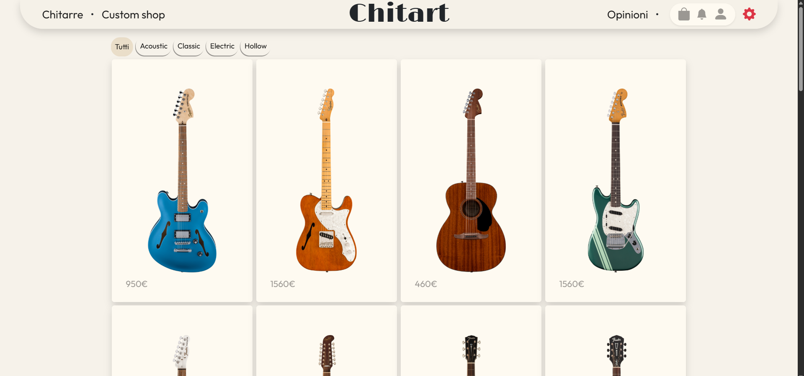

# Custom Guitar Shop – Full Stack Project

  

# 🎸 Chitart - il sito e-commerce di chitarre artiganali
🛜[Link del sito](https://proud-coast-0fc73eb03.1.azurestaticapps.net/)🛜

*(Al'inizio puo dare l'errore 500 perche' azure ha bisogno di ~30sec per "svegliare" sito)*

## 🚀 Panoramica

Il sito si divide in **4** parti principali:
- **Catalogo** di tutta la gamma di chitarre disponobili
- **Custom Shop**, che da la possibilita' di configurare la chitarra
- **Area Amministrativa**, per gestire tutte le entita'
- **Altre fuzionalita'**, che rendono l'esperienza del'utente piu fluida

## 💪 Technologie usate

Backend:
- C#
- ASP.NET CORE
- SQL Server
- EF Core
- API REST
- Identity
- JWT
- Swagger
- SignalR

Frontend:
- JS
- Bootstrap
- React
- React Context

# 🚴 Sezioni principali
## Catalogo:

*Con possibilita' di filtrare le chitarre in base al tipo di corpo*

*Pagina dettagli:*
