# 🎸 Chitart – Custom Guitar Shop (Full Stack Project)

  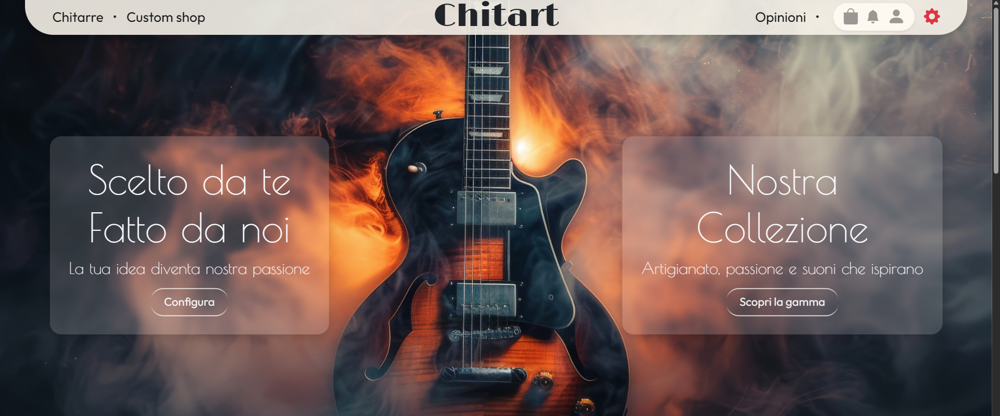

  🛜 <a href="https://proud-coast-0fc73eb03.1.azurestaticapps.net/">Visita il sito online</a> 🛜  

> ⚠️ *Al primo avvio potrebbe comparire un errore 500: Azure impiega ●30 secondi per “risvegliare” l’app.*

## 🚀 Panoramica

**Chitart** è un sito e-commerce dedicato alla vendita e configurazione di chitarre artigianali.  
Il progetto è diviso in **4 sezioni principali**:

- 🎸 **Catalogo**: visualizzazione completa di tutti i modelli disponibili  
- 🛠️ **Custom Shop**: configuratore per creare la propria chitarra personalizzata  
- 🧑‍💼 **Area Amministrativa**: gestione di prodotti, ordini, utenti e contenuti  
- ⚙️ **Funzionalità aggiuntive**: filtri, sorting, notifiche real-time, UX migliorata  

## 💪 Tecnologie utilizzate

### **Backend**
- C#
- ASP.NET Core
- SQL Server
- Entity Framework Core
- API REST
- Identity
- JWT Authentication
- Swagger
- SignalR

### **Frontend**
- JavaScript
- Bootstrap
- React
- React Context

---

# 🚴 Sezioni principali

## 1) Catalogo prodotti

> *Possibilità di filtrare le chitarre in base al tipo di corpo.*

  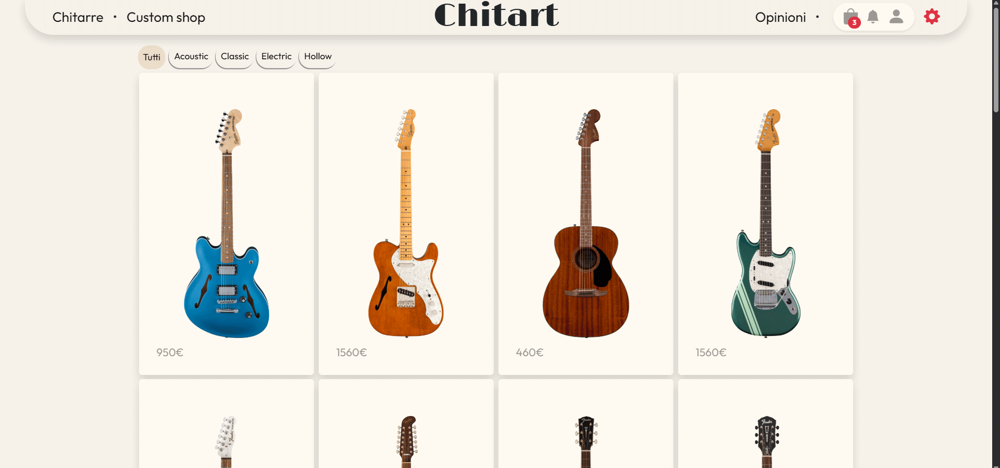

### 🔍 Pagina dettagli

  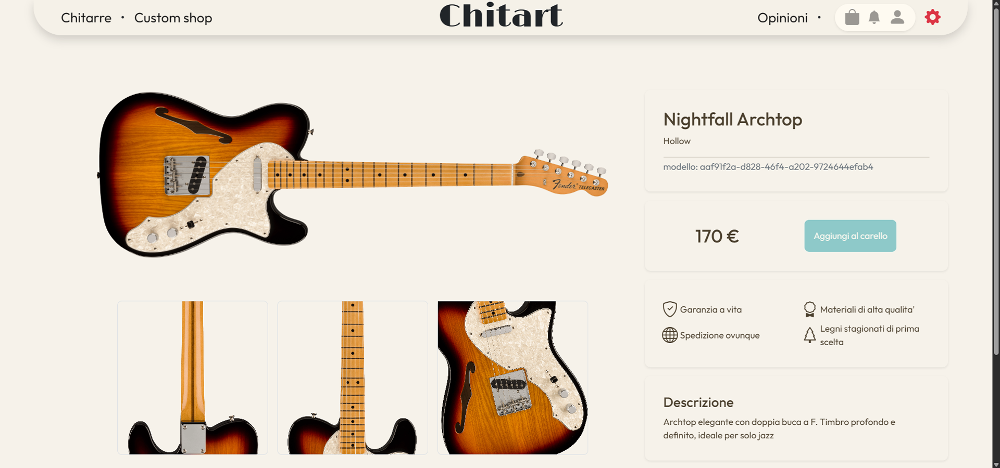

## 2) Custom Shop

> *L'utente puo scegliere il tipo di corpo.*

  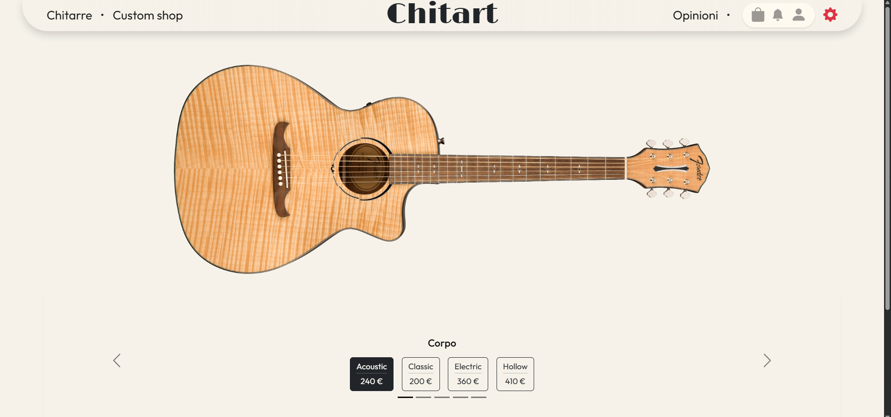

●

> *Il materiale.*

  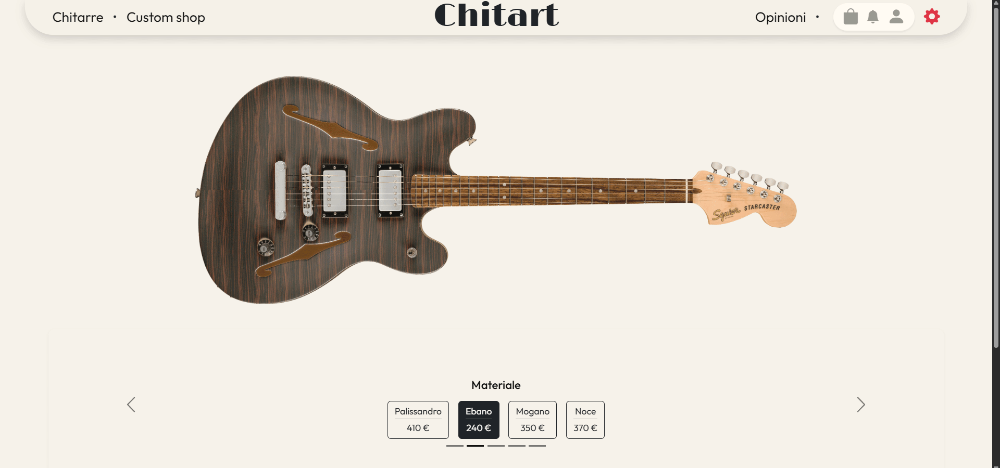

●

> *E colore.*

  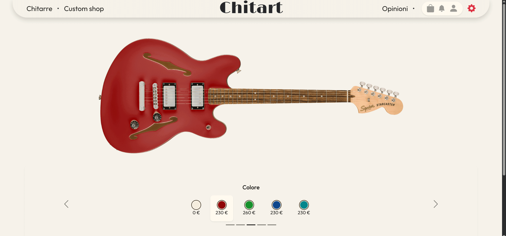

●

## 3) Cart Page

> *Sulla pagina del carello l'utente puo gestire il contenuto della cart prima di procedere al checkout*

  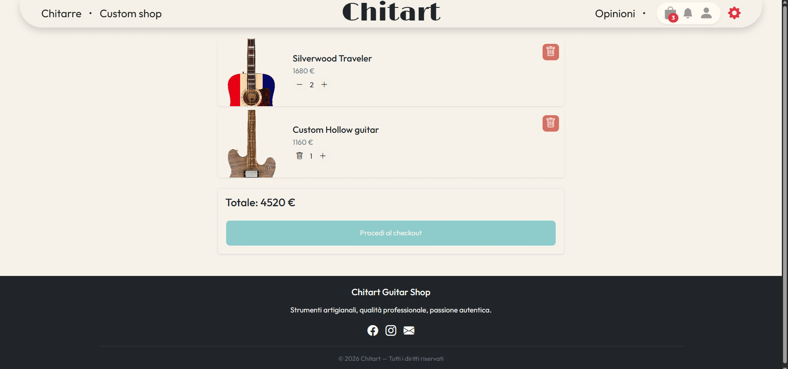

## 4) Gestione Account

### Panello utente

> *Il panello visualizza il contatore della cart, le notifiche e opzioni di profilo*

  

●

> *Dropdown con le opzioni*

  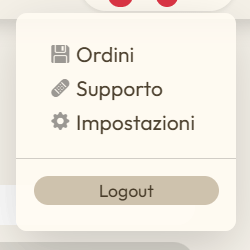

●

### Cronologia ordini

> *La pagina permette al'utente di vedere la storia di ordini effettuati*

  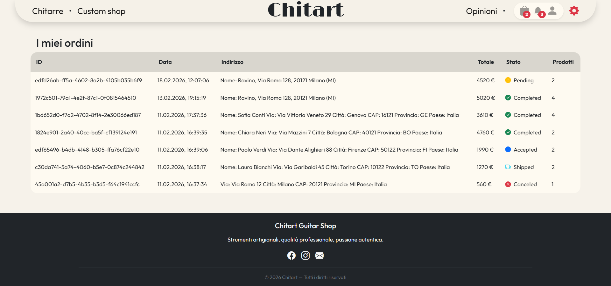

### Support

> *Pagina dedicata al supporto utenti, dove essi possono aprire un ticket con dubbi/domante etc., vedere lo stato, risposte e dati relativi ad ogni ticket*

  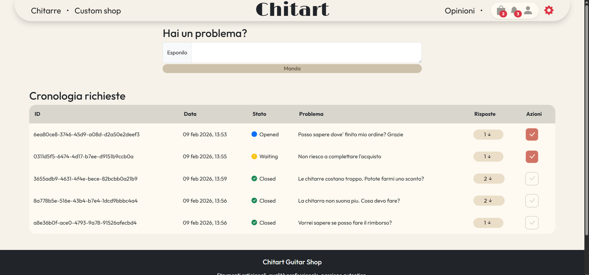

### Profile Settigs

> *Utente puo modificare il suo profilo e cambiare il ruolo (con limitazioni) per acedere al'area amministrativa*

  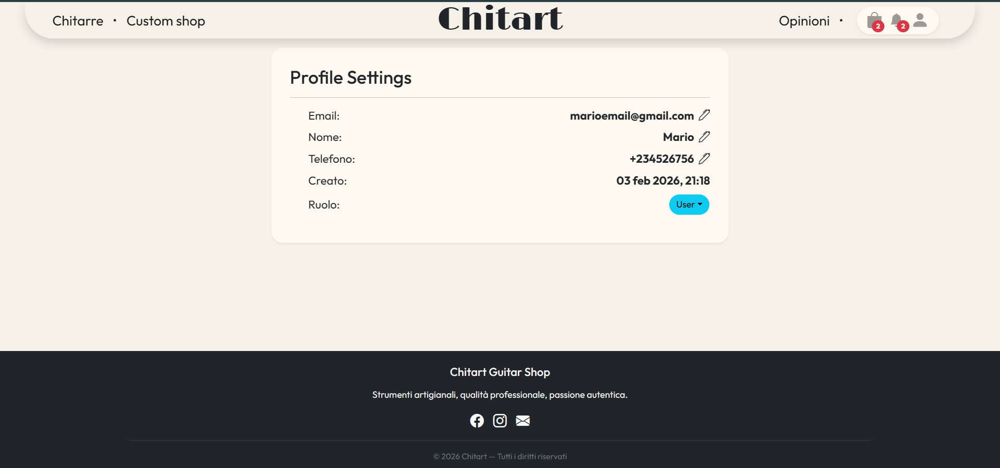

