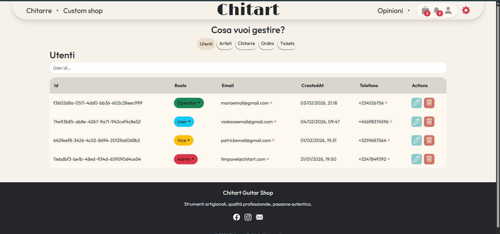

# 🎸 Chitart – Custom Guitar Shop (Full Stack Project)

  

  🛜 <a href="https://proud-coast-0fc73eb03.1.azurestaticapps.net/">Visita il sito online</a> 🛜

> ⚠️ *Al primo avvio potrebbe comparire un errore 500: Azure impiega ~30 secondi per “risvegliare” l’app.*

---

## 🚀 Panoramica

**Chitart** è un sito e-commerce dedicato alla vendita e configurazione di chitarre artigianali.  
Il progetto è diviso in **4 sezioni principali**:

- 🎸 **Catalogo**: visualizzazione completa di tutti i modelli disponibili  
- 🛠️ **Custom Shop**: configuratore per creare la propria chitarra personalizzata  
- 🧑‍💼 **Area Amministrativa**: gestione di prodotti, ordini, utenti e contenuti  
- ⚙️ **Funzionalità aggiuntive**: filtri, sorting, notifiche real-time, UX migliorata  

---

## 💪 Tecnologie utilizzate

### **Backend**
- C#
- ASP.NET Core
- SQL Server
- Entity Framework Core
- API REST
- Identity
- JWT Authentication
- Swagger
- SignalR

### **Frontend**
- JavaScript
- Bootstrap
- React
- React Context

---

# 🚴 Sezioni principali

## 1) Catalogo prodotti

> *Possibilità di filtrare le chitarre in base al tipo di corpo.*

  

### 🔍 Pagina dettagli

  

---

## 2) Custom Shop

> *L'utente può scegliere il tipo di corpo.*

  

> *Il materiale del corpo.*

  

> *E il colore.*

  

---

## 3) Pagina Carrello

> *L’utente può gestire il contenuto del carrello prima di procedere al checkout.*

  

---

## 4) Gestione Account

### Pannello utente

> *Il pannello mostra il contatore del carrello, le notifiche e le opzioni del profilo.*

  

> *Dropdown con le opzioni.*

  

---

### Cronologia ordini

> *La pagina permette all’utente di vedere la cronologia degli ordini effettuati.*

  

---

### Supporto

> *Pagina dedicata al supporto utenti, dove possono aprire un ticket, vedere lo stato, le risposte e i dettagli relativi a ogni richiesta.*

  

---

### Profile Settings

> *L’utente può modificare il proprio profilo e cambiare ruolo (con limitazioni) per accedere all’area amministrativa.*

  

## 5) Area amministrativa
> Per accedere all’area amministrativa è necessario cliccare sull’icona dell’ingranaggio rosso, situata a destra del “Pannello Utente”.

> ⚠️ *È necessario avere almeno il ruolo “Operator” (modificabile nelle impostazioni del profilo).*

  

---

### Gestione Utenti

> *In questa pagina è possibile effettuare ricerche, visualizzare la lista degli utenti e gestirli modificando i loro dati (incluso il ruolo).*

  

